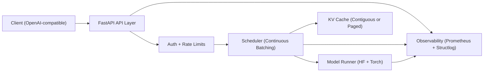

# InferLite

[](https://github.com/sboppudi4/inferlite/actions/workflows/ci.yml)
[](https://www.python.org/)
[](#license)

InferLite is a Python-first LLM inference server that implements the core serving ideas used in
modern production systems:

- continuous batching
- paged KV cache
- priority-aware multi-tenant scheduling
- OpenAI-compatible API surface
- metrics-first observability

InferLite is intentionally optimized for readability and systems understanding, not raw CUDA-level
throughput.

## Project thesis

InferLite answers a practical question: what do inference servers actually do between HTTP request
arrival and next-token emission?

The repository is designed so an ML infra hiring manager can read scheduler and cache code in
isolation and understand the trade-offs, limitations, and benchmark evidence.

For the reasoning behind each design decision (and an honest list of what is and isn't wired up yet),
see **[`docs/design.md`](docs/design.md)**. For a narrative walkthrough, see the
**[blog post](docs/blog-post.md)**.

## Architecture



## Key modules

- `src/inferlite/api/`: `/v1/completions`, `/v1/chat/completions`, SSE streaming, admin key APIs
- `src/inferlite/engine/`: naive baseline runner + static batch model runner
- `src/inferlite/scheduler/`: priority queue + continuous batching + preemption
- `src/inferlite/cache/`: contiguous baseline and paged block allocator
- `src/inferlite/auth/`: SQLite API key store and per-key rate limiting
- `src/inferlite/observability/`: Prometheus metrics and structured logging hooks

## Quickstart

```bash
python -m venv .venv
source .venv/bin/activate  # Windows: .venv\Scripts\activate
pip install -e ".[dev]"
uvicorn inferlite.api.app:app --host 0.0.0.0 --port 8000
```

Create an API key:

```bash
curl -X POST http://localhost:8000/admin/keys \
  -H "x-admin-secret: <INFERLITE_ADMIN_BOOTSTRAP_SECRET>" \
  -H "Content-Type: application/json" \
  -d '{"tier":"paid","requests_per_minute":500}'
```

Call completions:

```bash
curl -X POST http://localhost:8000/v1/completions \
  -H "Authorization: Bearer <API_KEY>" \
  -H "Content-Type: application/json" \
  -d '{
    "model":"gpt2",
    "prompt":"Continuous batching means",
    "max_tokens":32
  }'
```

Call chat completions:

```bash
curl -X POST http://localhost:8000/v1/chat/completions \
  -H "Authorization: Bearer <API_KEY>" \
  -H "Content-Type: application/json" \
  -d '{
    "model":"gpt2",
    "messages":[{"role":"user","content":"Explain paged KV cache briefly"}],
    "max_tokens":64
  }'
```

Metrics endpoint:

```bash
curl http://localhost:8000/metrics
```

## Docker

```bash
docker compose up --build
```

The container uses a CUDA runtime base image for GPU deployment paths.

Environment variables are documented in `.env.example`.

## Benchmarks

InferLite includes a reproducible benchmark harness under `benchmarks/` with workload configs,
runner scripts, plotting, and report generation.

**Measured result (CPU-only, reproducible):** paging the KV cache into 16-token blocks instead of
64-token contiguous chunks cuts wasted KV memory by **~77%** and lifts utilization from **80.5% to
94.6%** on short variable-length workloads. Full table, method, and the GPU throughput report
scaffold: **[`benchmarks/RESULTS.md`](benchmarks/RESULTS.md)**.

```bash
# reproduce the fragmentation numbers (no GPU required)
python benchmarks/scripts/kv_cache_memory_benchmark.py --requests 512 --max-seq-len 256 --seed 7
```

See also:

- [`benchmarks/README.md`](benchmarks/README.md) — how to run the full inferlite/naive/vllm matrix
- [`benchmarks/RESULTS.md`](benchmarks/RESULTS.md) — results and reproduction steps
- `benchmarks/configs/default_workload.json`, `benchmarks/configs/bursty_workload.json`

## Deployment

- Deployment playbook: `docs/deployment.md`
- Recommended target: single GPU VM first for reproducible benchmarking

## Observability

- Prometheus metrics: request latency, TTFT, TPOT, batch sizes, token counters
- Structured logs with trace IDs
- Grafana starter dashboard:
  - `deploy/grafana/dashboard.json`

## What InferLite is and is not

InferLite is:

- a teaching-quality implementation of inference internals
- a benchmarked systems project with explicit trade-offs
- a Python reference design for scheduler/cache behavior

InferLite is not:

- a vLLM replacement
- a CUDA kernel project
- a claim that Python can match optimized serving stacks in absolute throughput

## Roadmap status

- Phase 0: foundation and naive baseline complete
- Phase 1: model runner and static batching complete
- Phase 2: contiguous and paged KV cache complete
- Phase 3: continuous batching scheduler complete
- Phase 4: API + multi-tenant auth/rate limits complete
- Phase 5: metrics and tracing complete
- Phase 6: benchmark harness complete
- Phase 7: shipping polish complete

## License

MIT
