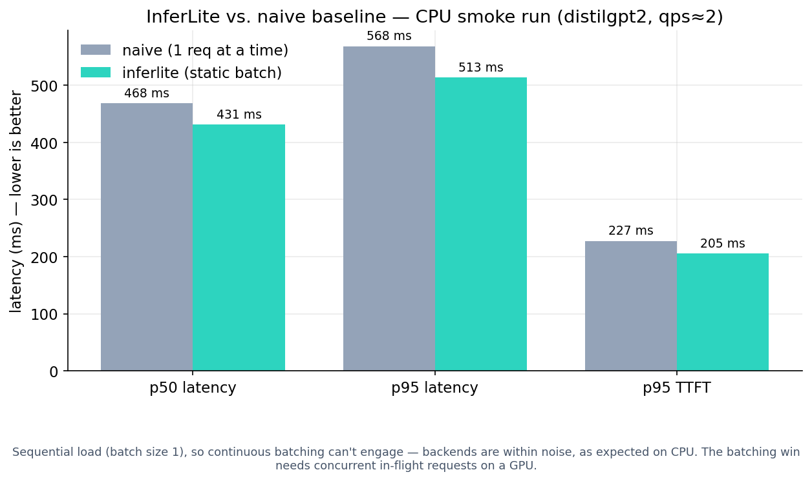

# Benchmark Results

> **Status: results pending a benchmark run.** This file is the report scaffold. The numbers below
> are placeholders (`TBD`) until the harness is run on fixed hardware. They are intentionally *not*
> filled with invented values — a benchmark you can't reproduce is worse than no benchmark.

## How these numbers are produced

All rows come from the harness in `benchmarks/`, not from hand-edited values:

```bash
# 1. Start InferLite (and, for the comparison, a vLLM server on :8001)
uvicorn inferlite.api.app:app --port 8000

# 2. Mint a key
curl -X POST http://localhost:8000/admin/keys \
  -H "x-admin-secret: $INFERLITE_ADMIN_BOOTSTRAP_SECRET" \
  -H "Content-Type: application/json" \
  -d '{"tier":"paid","requests_per_minute":1000}'

# 3. Run the full matrix (inferlite + naive + vllm × steady + bursty)
python benchmarks/scripts/run_matrix.py --api-key <KEY> \
  --inferlite-url http://localhost:8000 --vllm-url http://localhost:8001

# 4. Generate charts + this report's table
python benchmarks/scripts/plot_results.py \
  --csv benchmarks/results/benchmark_summary.csv --out-dir benchmarks/results
```

Step 4 writes `benchmarks/results/benchmark_report.md`; copy its table into the section below and
commit the PNGs.

## Test environment (fill in when you run)

| Field | Value |
|---|---|
| Model | `TBD` (e.g. gpt2 / a 1.3B-class model) |
| Hardware | `TBD` (GPU class or CPU) |
| dtype | `TBD` |
| InferLite version | `TBD` (git SHA) |
| vLLM version | `TBD` |
| Date | `TBD` |

Keep model, dtype, GPU class, and prompt/output length distributions **identical** across backends,
or the comparison is meaningless.

## Throughput / latency

### Measured: CPU smoke run (real, reproducible)

Backend: `inferlite` (`/v1/completions`) vs `naive` (`/v1/completions/baseline`). Model
`distilgpt2`, CPU only, workload `benchmarks/configs/cpu_smoke_workload.json` (8 requests, qps≈2,
16–32 output tokens, `seed=7`). **Both runners were warmed once before timing** so the numbers
reflect steady-state compute, not one-time model download/load. vLLM is omitted — it needs
Linux + GPU and does not run in this environment.

| backend | req_ok | tok/s | p50 latency (s) | p95 latency (s) | p95 TTFT (s) | p95 TPOT (s) |
|---|---:|---:|---:|---:|---:|---:|
| inferlite | 8/8 | 49.3 | 0.431 | 0.513 | 0.205 | 0.011 |
| naive | 8/8 | 49.4 | 0.468 | 0.568 | 0.227 | 0.015 |



**Honest reading of this result:**

- The two backends are **within noise of each other** (inferlite is marginally lower-latency). This
  is the *expected* outcome, not a disappointment: the load generator fires requests sequentially,
  so InferLite's static batcher only ever sees batch size 1 and its batching advantage cannot
  appear. See `docs/design.md` §5 — the continuous-batching win requires concurrent in-flight
  requests, which in turn needs a GPU to be worth measuring.
- Aggregate `tok/s` here is partly **arrival-rate bound** (qps≈2 pacing), so per-request **latency**
  is the more meaningful column for this workload.
- Reproduce: `make bench-cpu` (see below) or the two `run_benchmark.py` invocations with
  `--workload benchmarks/configs/cpu_smoke_workload.json`.

The committed latency chart above lives at `docs/assets/cpu_smoke_latency.png`; regenerate it with
`python -m benchmarks.scripts.plot_cpu_smoke` after a CPU run. The per-metric charts
(`throughput_tokens_per_s.png`, `latency_p95_s.png`, `ttft_p95_s.png`) are written under
`benchmarks/results/` (git-ignored) by `plot_results.py`.

### Pending: GPU matrix (inferlite vs naive vs vLLM, concurrent load)

This is the run that actually exercises continuous batching, on real hardware. Numbers are `TBD`
until run on a GPU host; do **not** read CPU smoke numbers as a substitute.

| backend | workload | req_ok | tok/s | p95 latency (s) | p95 TTFT (s) | p95 TPOT (s) |
|---|---|---:|---:|---:|---:|---:|
| naive | default | TBD | TBD | TBD | TBD | TBD |
| inferlite | default | TBD | TBD | TBD | TBD | TBD |
| vllm | default | TBD | TBD | TBD | TBD | TBD |
| naive | bursty | TBD | TBD | TBD | TBD | TBD |
| inferlite | bursty | TBD | TBD | TBD | TBD | TBD |
| vllm | bursty | TBD | TBD | TBD | TBD | TBD |

## KV cache fragmentation (measured, no GPU required)

This one runs anywhere — it measures reserved-vs-used bytes from the allocators directly. Numbers
below are **real**, produced by the command shown, fully reproducible with the given seed. Model
shape: 32 layers × 32 heads × 128 head-dim, fp16; contiguous uses 64-token chunks, paged uses
16-token blocks.

```bash
# variable-length, long sequences (8–2048 tokens)
python benchmarks/scripts/kv_cache_memory_benchmark.py --requests 512 --max-seq-len 2048 --seed 7
# variable-length, short sequences (8–256 tokens)
python benchmarks/scripts/kv_cache_memory_benchmark.py --requests 512 --max-seq-len 256  --seed 7
```

| workload (512 reqs) | cache | utilization | reserved (MB) | waste (MB) |
|---|---|---:|---:|---:|
| seq 8–2048 | contiguous (64) | 97.04% | 267,104 | 7,917.5 |
| seq 8–2048 | **paged (16)**  | **99.31%** | 260,984 | **1,797.5** |
| seq 8–256  | contiguous (64) | 80.49% | 40,896 | 7,978.5 |
| seq 8–256  | **paged (16)**  | **94.63%** | 34,784 | **1,866.5** |

**Takeaways (these match the design prediction in `docs/design.md` §3):**

- Paged blocks cut wasted KV memory by **~77%** in both workloads (7,917→1,798 MB and 7,979→1,867 MB)
  because worst-case internal waste drops from `chunk_size-1` (63) to `block_size-1` (15) tokens per
  request.
- The win is largest on **short, variable-length** requests: utilization climbs from **80.5% → 94.6%**.
  When sequences are long relative to the chunk, the tail waste is amortized and the gap narrows
  (97.0% → 99.3%) — exactly the regime where paging matters least.

## Interpreting the results honestly

- InferLite is Python and is **expected to lose to vLLM on absolute throughput.** The interesting
  comparison is **inferlite vs naive** (does continuous batching help?) and the **shape** of the
  inferlite-vs-vllm gap, not the headline number.
- Report losses as plainly as wins. The goal is architectural understanding, per the project thesis.
